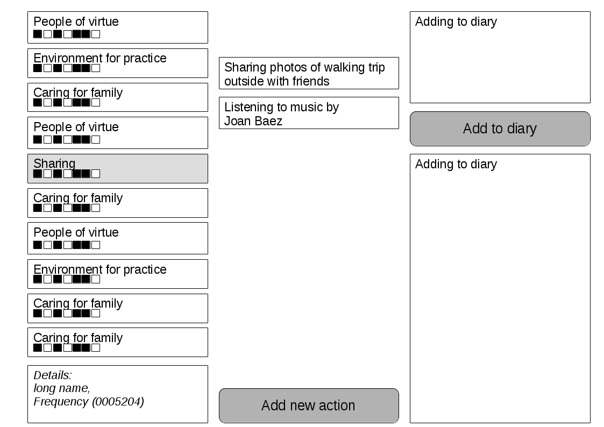

***Early draft, not the final version***

Reviewed by:
* No-one yet

For a more general ("high-level") understanding of where the information below fits into the requirements analysis and the software development process in general, please see [this article](http://en.wikipedia.org/wiki/Requirements_analysis)

<When editing this document, please do not remove the comments for each section which can be seen when editing (inside the lesser than and greater than signs), since these comments gives suggestions on how to write each section>

# Software Requirements Specification for Buddhist Well-Being

This document is based on a template with this copyright: "Copyright © 1999 by Karl E. Wiegers. Permission is granted to use, modify, and distribute this document."

### Revision History

See commit notes for this file

## 1. Introduction

### 1.1 Purpose
<Identify the product whose software requirements are specified in this document, including the revision or release number. Describe the scope of the product that is covered by this SRS, particularly if this SRS describes only part of the system or a single subsystem.>

Software requirement specification (SRS) for Buddhist Well-Being version 1.0

### 1.2 Document Conventions
<Describe any standards or typographical conventions that were followed when writing this SRS, such as fonts or highlighting that have special significance. For example, state whether priorities  for higher-level requirements are assumed to be inherited by detailed requirements, or whether every requirement statement is to have its own priority.>

* *The name* ***"Buddhist Well-Being"*** *is a working project name, it will likely change in the future*
* If a future version of the software is discussed this will be explicitly mentioned in this document. Otherwise version 1.0 is implicitly assumed

### 1.3 Intended Audience and Reading Suggestions
<Describe the different types of reader that the document is intended for, such as developers, project managers, marketing staff, users, testers, and documentation writers. Describe what the rest of this SRS contains and how it is organized. Suggest a sequence for reading the document, beginning with the overview sections and proceeding through the sections that are most pertinent to each reader type.>

This document can be read by everyone, both tech and non-tech people. This document can be seen as the "interface" between these two groups, it is therefore important that both groups understand it and that the language used is not too technical

### 1.4 Product Scope
<Provide a short description of the software being specified and its purpose, including relevant benefits, objectives, and goals. Relate the software to corporate goals or business strategies. If a separate vision and scope document is available, refer to it rather than duplicating its contents here.>

Building a desktop application that helps Buddhist laypeople achieve true happiness

### 1.5 References
<List any other documents or Web addresses to which this SRS refers. These may include user interface style guides, contracts, standards, system requirements specifications, use case documents, or a vision and scope document. Provide enough information so that the reader could access a copy of each reference, including title, author, version number, date, and source or location.>

Idea based on the ______- sutra, specifically this passage (translation to English by Thich Nhat Hanh):

> True happiness can be realized in this very life, especially when you observe the following:
> 
> 1. Foster relations with people of virtue and avoid the path of degradation
> 
> 2. Live in an environment that is conducive to spiritual practice and builds good character
> 
> 3. Foster opportunities to learn more about the Dharma, the precepts, and your own trade in greater depth
> (Non-buddhists: Wisdom, precepts???, trade)
> 
> 4. Take the time to care well for your parents, spouse, and children
> 
> 5. Share time, resources, and happiness with others
> 
> 6. Foster opportunities to cultivate virtue. Avoid alcohol and gambling
> 
> 7. Cultivate humility, gratitude, and simple living
> 
> 8. Seek opportunities to be close to bhikkhus in order to study the Way
> ()
> 
> 9. Live a life based on the Four Noble Truths
> ()
> 
> 10. Learn how to meditate in order to release sorrows and anxieties

Links:
* https://en.wikipedia.org/wiki/Sigalovada_Sutta
* http://www.accesstoinsight.org/tipitaka/dn/dn.31.0.nara.html
* http://www.accesstoinsight.org/tipitaka/dn/dn.31.0.ksw0.html

From wikipedia:
> In modern times, Bhikkhu Bodhi has identified this sutta as the "most comprehensive Nikāya text" which pertains "to the happiness directly visible in this present life."

* https://en.wikipedia.org/wiki/Dighajanu_Sutta
* http://www.accesstoinsight.org/tipitaka/an/an08/an08.054.than.html
* http://www.accesstoinsight.org/tipitaka/an/an08/an08.054.nara.html

A suggestion for a shortened version:
* Friends of Virtue
* Environment
* Learning
* Caring for Family
* Sharing
* Cultivating Virtue
* Gratitude
* Monks (Non-buddhists: Wise and peaceful people)
* Four Noble Truths (Non-buddhists: Self-compassion and compassion)
* Meditation

## 2. Overall Description

### 2.1 Product Perspective
<Describe the context and origin of the product being specified in this SRS. For example, state whether this product is a follow-on member of a product family, a replacement for certain existing systems, or a new, self-contained product. If the SRS defines a component of a larger system, relate the requirements of the larger system to the functionality of this software and identify interfaces between the two. A simple diagram that shows the major components of the overall system, subsystem interconnections, and external interfaces can be helpful.>

### 2.2 Product Functions
<Summarize the major functions the product must perform or must let the user perform. Details will be provided in Section 3, so only a high level summary (such as a bullet list) is needed here. Organize the functions to make them understandable to any reader of the SRS. A picture of the major groups of related requirements and how they relate, such as a top level data flow diagram or object class diagram, is often effective.>

We want the user to be able to:
* Be concious of each of the ten observances
  * (Maybe by having a list of them in front of her)
* Get feedback on the ten observances
  * Passive feedback
    * Has the user done one of them recently?
    * How frequently?
  * Active feedback
    * Software-internal notifications
* Have a list of suggestions for actions for each of the ten observances
* Read diary entries
* Connection to general diary in txt form

Low prio features:
* Sharing sections of diary with friends

### 2.3 User Classes and Characteristics
<Identify the various user classes that you anticipate will use this product. User classes may be differentiated based on frequency of use, subset of product functions used, technical expertise, security or privilege levels, educational level, or experience. Describe the pertinent characteristics of each user class. Certain requirements may pertain only to certain user classes. Distinguish the most important user classes for this product from those who are less important to satisfy.>

#### Buddhists
* Priority: High
* Considerations: 

#### Others
* Priority: Low
* Considerations: It may be difficult to adapt the sutras because some of the 10 points in the sutra text is specifically Buddhist. Ideas for future adaption:
  * Four Noble Truths -> Love and compassion (and self-compassion)
  * -

### 2.4 Operating Environment
<Describe the environment in which the software will operate, including the hardware platform, operating system and versions, and any other software components or applications with which it must peacefully coexist.>

GNU/Linux, Windows, MacOS

### 2.5 Design and Implementation Constraints
<Describe any items or issues that will limit the options available to the developers. These might include: corporate or regulatory policies; hardware limitations (timing requirements, memory requirements); interfaces to other applications; specific technologies, tools, and databases to be used; parallel operations; language requirements; communications protocols; security considerations; design conventions or programming standards (for example, if the customer’s organization will be responsible for maintaining the delivered software).>

### 2.6 User Documentation
<List the user documentation components (such as user manuals, on-line help, and tutorials) that will be delivered along with the software. Identify any known user documentation delivery formats or standards.>

* The interface is hoped to be intuitive enough to not require a manual
* The menu may be used to hold a help section in case this is needed

### 2.7 Assumptions and Dependencies
<List any assumed factors (as opposed to known facts) that could affect the requirements stated in the SRS. These could include third-party or commercial components that you plan to use, issues around the development or operating environment, or constraints. The project could be affected if these assumptions are incorrect, are not shared, or change. Also identify any dependencies the project has on external factors, such as software components that you intend to reuse from another project, unless they are already documented elsewhere (for example, in the vision and scope document or the project plan).>

Programming language: Python version 3

Python modules:
* PyQt5
* sqlite3

## 3. External Interface Requirements

### 3.1 User Interfaces
<Describe the logical characteristics of each interface between the software product and the users. This may include sample screen images, any GUI standards or product family style guides that are to be followed, screen layout constraints, standard buttons and functions (e.g., help) that will appear on every screen, keyboard shortcuts, error message display standards, and so on. Define the software components for which a user interface is needed. Details of the user interface design should be documented in a separate user interface specification.>

#### Section 1: List of ten observances

Components:
* A list of ten rows
  * ..without scroll
  * ..the text in each row is shortened so that it is visible
  * Under the text in each row there are small horizontal markings that indicate whether the observance has been added to the diary (either through an action (see below) or directly)
* A details area below the list
  * Contains the long version of each of the ten observances
  * Contains the frequency and/or other info about progress/success

#### Section 2: Actions
* An action belongs to and support one of the observances

Button: Adding a new action

#### Section 3: Diary
Diary shows history for the last seven days

### 3.2 Hardware Interfaces
<Describe the logical and physical characteristics of each interface between the software product and the hardware components of the system. This may include the supported device types, the nature of the data and control interactions between the software and the hardware, and communication protocols to be used.>

### 3.3 Software Interfaces
<Describe the connections between this product and other specific software components (name and version), including databases, operating systems, tools, libraries, and integrated commercial components. Identify the data items or messages coming into the system and going out and describe the purpose of each. Describe the services needed and the nature of communications. Refer to documents that describe detailed application programming interface protocols. Identify data that will be shared across software components. If the data sharing mechanism must be implemented in a specific way (for example, use of a global data area in a multitasking operating system), specify this as an implementation constraint.>

Database:
TBD

### 3.4 Communications Interfaces
<Describe the requirements associated with any communications functions required by this product, including e-mail, web browser, network server communications protocols, electronic forms, and so on. Define any pertinent message formatting. Identify any communication standards that will be used, such as FTP or HTTP. Specify any communication security or encryption issues, data transfer rates, and synchronization mechanisms.>

These tags are used to indicate that a diary entry is connected to one of the ten practices:

> [Sharing]
> 
> [Monks]
> 
> [___]
> 

They are also used for the statistics

## 4. System Features
<This template illustrates organizing the functional requirements for the product by system features, the major services provided by the product. You may prefer to organize this section by use case, mode of operation, user class, object class, functional hierarchy, or combinations of these, whatever makes the most logical sense for your product.>

#### 4.1 Row with observance updated when the user adds new entry to the diary
<State the feature name in just a few words.>

##### Description and Priority
<Provide a short description of the feature and indicate whether it is of High, Medium, or Low priority. You could also include specific priority component ratings, such as benefit, penalty, cost, and risk (each rated on a relative scale from a low of 1 to a high of 9).>

Description: The user gets feedback on what she has done in the last seven days. Ex: 0011101

Priority: Medium

##### Stimulus/Response Sequences
<List the sequences of user actions and system responses that stimulate the behavior defined for this feature. These will correspond to the dialog elements associated with use cases.>

Stimulus: The user clicks on the "add to diary" button

Response: One (or more) row in the list of observances is updated by changing a "0" to a "1" (nothing happens if there is already a "1" in that place)

##### Functional Requirements
<Itemize the detailed functional requirements associated with this feature. These are the software capabilities that must be present in order for the user to carry out the services provided by the feature, or to execute the use case. Include how the product should respond to anticipated error conditions or invalid inputs. Requirements should be concise, complete, unambiguous, verifiable, and necessary. Use "TBD" as a placeholder to indicate when necessary information is not yet available.>

<Each requirement should be uniquely identified with a sequence number or a meaningful tag of some kind.>

* **NTN-1:** App updates the row with new indication of progress

#### 4.2 Reminders for actions
<State the feature name in just a few words.>

##### Description and Priority
<Provide a short description of the feature and indicate whether it is of High, Medium, or Low priority. You could also include specific priority component ratings, such as benefit, penalty, cost, and risk (each rated on a relative scale from a low of 1 to a high of 9).>

Description:

Ex: Reminder to call dad

Prio: Medium

##### Stimulus/Response Sequences
<List the sequences of user actions and system responses that stimulate the behavior defined for this feature. These will correspond to the dialog elements associated with use cases.>

##### Functional Requirements
<Itemize the detailed functional requirements associated with this feature. These are the software capabilities that must be present in order for the user to carry out the services provided by the feature, or to execute the use case. Include how the product should respond to anticipated error conditions or invalid inputs. Requirements should be concise, complete, unambiguous, verifiable, and necessary. Use "TBD" as a placeholder to indicate when necessary information is not yet available.>

<Each requirement should be uniquely identified with a sequence number or a meaningful tag of some kind.>

* **SCH-1:**

#### 4.3 Store diary entries in files
<State the feature name in just a few words.>

##### Description and Priority
<Provide a short description of the feature and indicate whether it is of High, Medium, or Low priority. You could also include specific priority component ratings, such as benefit, penalty, cost, and risk (each rated on a relative scale from a low of 1 to a high of 9).>

Description: There are txt files where the user can store entries. *TBD: How many days are in one file?* Please note that if switching files we may not be able to see previous entries in the software (unless we append several files to each other)

Priority: High

##### Stimulus/Response Sequences
<List the sequences of user actions and system responses that stimulate the behavior defined for this feature. These will correspond to the dialogue elements associated with use cases.>

##### Functional Requirements
<Itemize the detailed functional requirements associated with this feature. These are the software capabilities that must be present in order for the user to carry out the services provided by the feature, or to execute the use case. Include how the product should respond to anticipated error conditions or invalid inputs. Requirements should be concise, complete, unambiguous, verifiable, and necessary. Use "TBD" as a placeholder to indicate when necessary information is not yet available.>

<Each requirement should be uniquely identified with a sequence number or a meaningful tag of some kind.>

* **SCH-3:** 

## 5. Other Nonfunctional Requirements

### 5.1 Performance Requirements
<If there are performance requirements for the product under various circumstances, state them here and explain their rationale, to help the developers understand the intent and make suitable design choices. Specify the timing relationships for real time systems. Make such requirements as specific as possible. You may need to state performance requirements for individual functional requirements or features.>

### 5.2 Safety Requirements
<Specify those requirements that are concerned with possible loss, damage, or harm that could result from the use of the product. Define any safeguards or actions that must be taken, as well as actions that must be prevented. Refer to any external policies or regulations that state safety issues that affect the product’s design or use. Define any safety certifications that must be satisfied.>

### 5.3 Security Requirements
<Specify any requirements regarding security or privacy issues surrounding use of the product or protection of the data used or created by the product. Define any user identity authentication requirements. Refer to any external policies or regulations containing security issues that affect the product. Define any security or privacy certifications that must be satisfied.>

### 5.4 Software Quality Attributes
<Specify any additional quality characteristics for the product that will be important to either the customers or the developers. Some to consider are: adaptability, availability, correctness, flexibility, interoperability, maintainability, portability, reliability, reusability, robustness, testability, and usability. Write these to be specific, quantitative, and verifiable when possible. At the least, clarify the relative preferences for various attributes, such as ease of use over ease of learning.>

#### ..for the users

##### Usability
* **USY-1:** The app is intuitive enough that the ordinary user does not need any help using the app

##### Reliability
* **REL-1:**

#### ..for the designers

##### Portability
* **POY-1:**

#### ..for the developers

##### Interoperability
* **IOY-1:**

##### Reusability
* **REU-1:** The app tech architechture uses whenever possible standard solutions to avoid future problems for developers

### 5.5 Business Rules
<List any operating principles about the product, such as which individuals or roles can perform which functions under specific circumstances. These are not functional requirements in themselves, but they may imply certain functional requirements to enforce the rules.>

### 5.6 Other Requirements
<Define any other requirements not covered elsewhere in the SRS. This might include database requirements, internationalization requirements, legal requirements, reuse objectives for the project, and so on. Add any new sections that are pertinent to the project.>

### Appendix A: Glossary
<Define all the terms necessary to properly interpret the SRS, including acronyms and abbreviations. You may wish to build a separate glossary that spans multiple projects or the entire organization, and just include terms specific to a single project in each SRS.>

### Appendix B: Analysis Models
<Optionally, include any pertinent analysis models, such as data flow diagrams, class diagrams, state-transition diagrams, or entity-relationship diagrams.>

### Appendix C: To Be Determined List
<Collect a numbered list of the TBD (to be determined) references that remain in the SRS so they can be tracked to closure.>

